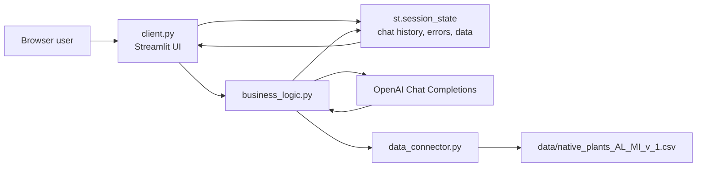
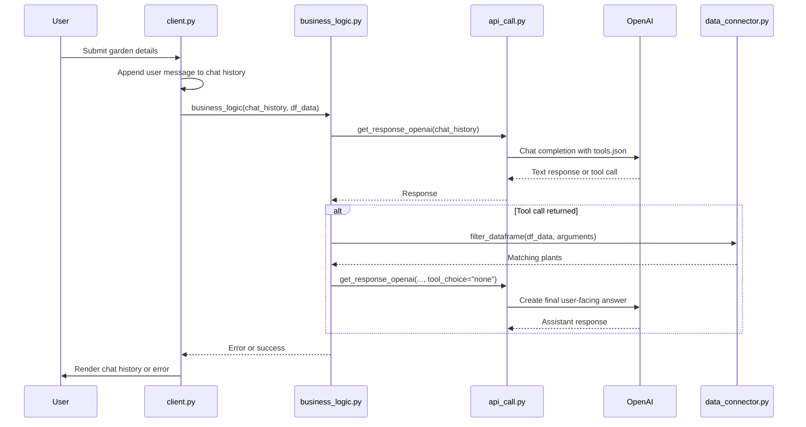
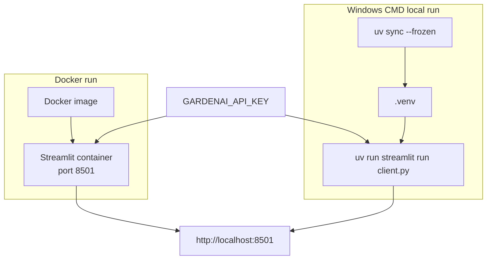

# Architecture

`gardenai` is a single-process Streamlit application. The browser talks to the
Streamlit server, Streamlit stores chat state in `st.session_state`, and the app
uses OpenAI tool calling to turn user garden preferences into filters for the
local native-plant CSV.

## High-level structure

## Module responsibilities

| File | Responsibility |
| --- | --- |
| `client.py` | Builds the Streamlit UI, initializes session state, loads data, and handles chat/reset callbacks. |
| `business_logic.py` | Sends chat history to OpenAI, handles tool calls, filters plant data, and appends assistant responses. |
| `api_call.py` | Loads `GARDENAI_API_KEY`, reads `tools.json`, and calls OpenAI chat completions. |
| `data_connector.py` | Loads the CSV with pandas and filters it from tool-call arguments. |
| `tools.json` | Defines the function schema OpenAI can use to request plant filtering. |
| `data/native_plants_AL_MI_v_1.csv` | Native plant dataset for Michigan and Alabama. |

## Chat request flow

## Runtime and deployment

The local workflow uses `uv sync --frozen` so dependencies come from
`pyproject.toml` and `uv.lock`. The Dockerfile copies `uv` into a Python 3.12
image, runs `uv sync --frozen --no-dev`, exposes port `8501`, and starts
Streamlit on `0.0.0.0`.
