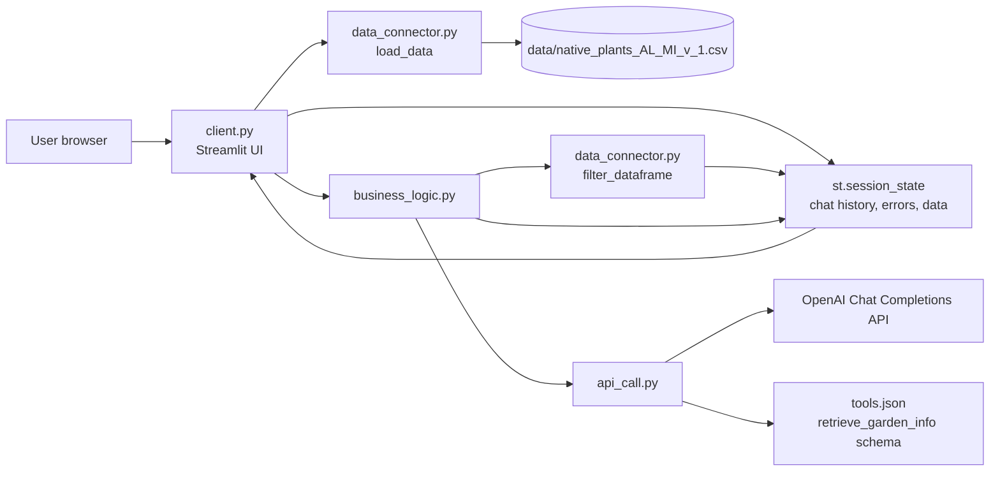
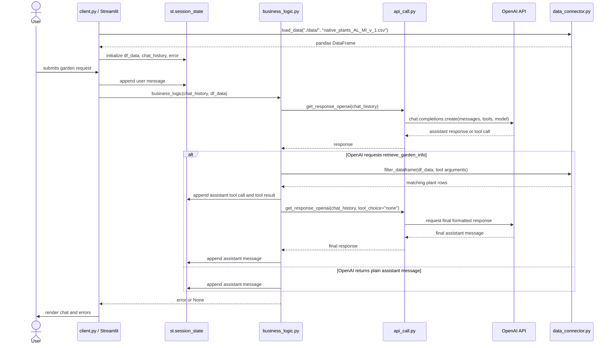
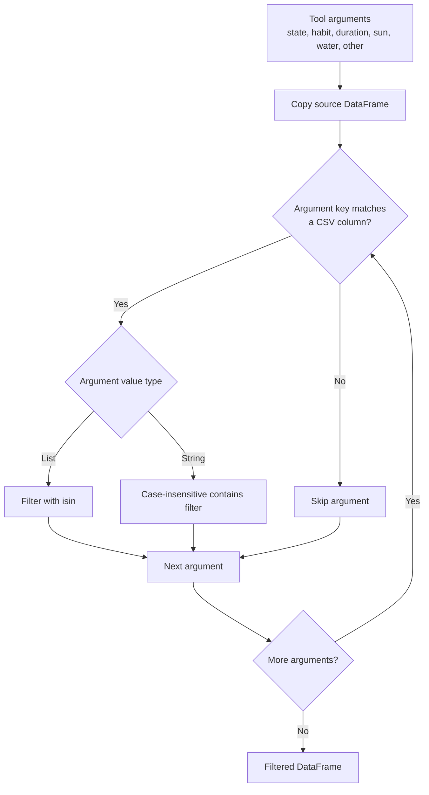

# Architecture

GardenAI is a small Streamlit application with a local CSV data source and an
OpenAI chat-completions integration. The core runtime path is:

1. `client.py` renders the Streamlit UI and manages `st.session_state`.
2. `data_connector.py` loads the native plant CSV into a pandas DataFrame.
3. User messages are appended to the chat history.
4. `business_logic.py` sends the chat history to OpenAI through `api_call.py`.
5. OpenAI may call the `retrieve_garden_info` tool defined in `tools.json`.
6. The app filters the DataFrame based on the tool arguments.
7. The filtered plant names are sent back to OpenAI as tool output.
8. OpenAI returns a user-facing response, which Streamlit displays.

## Component Diagram

## Runtime Sequence

## Data Filtering

## File Responsibilities

| File | Responsibility |
| --- | --- |
| `client.py` | Streamlit layout, chat input, reset button, session state setup, and display rendering. |
| `business_logic.py` | OpenAI response handling, tool-call handling, plant filtering orchestration, and user-facing response generation. |
| `api_call.py` | Environment loading, OpenAI client setup, `tools.json` loading, and chat completion calls. |
| `data_connector.py` | CSV loading and DataFrame filtering helpers. |
| `tools.json` | Tool schema that tells OpenAI how to structure extracted garden information. |
| `data/native_plants_AL_MI_v_1.csv` | Local plant dataset used for recommendations. |

## Environment and Runtime Boundaries

- The browser talks only to Streamlit.
- Streamlit runs locally or inside Docker.
- The app calls OpenAI over the network and requires `GARDENAI_API_KEY`.
- Plant recommendation data is read from the local CSV file.
- No database server is required.
